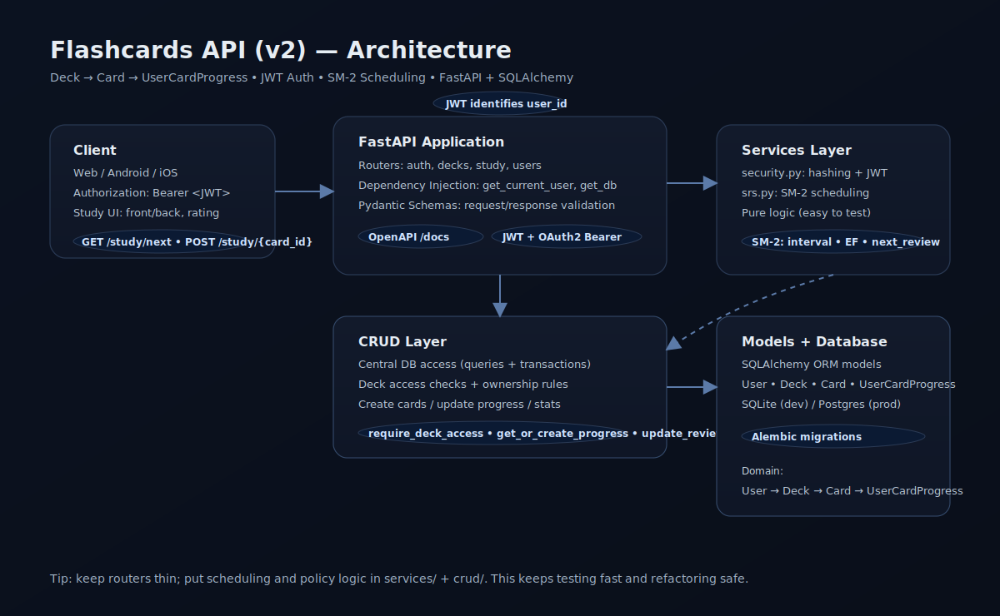
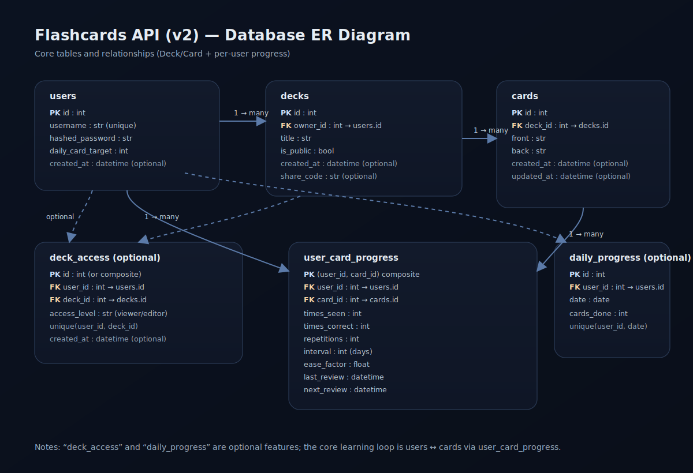

# Flashcards Learning API

Built a full-featured spaced repetition backend using FastAPI with authentication, SRS algorithm implementation, deck management, study sessions, and performance analytics.

------------------------------------------------------------------------

## Features

- JWT Authentication
- Deck & Card Management
- Per-User Progress Tracking
- SM-2 Spaced Repetition Algorithm
- Smart Study Queue (/study/next)
- Due / New Card Prioritization
- Alembic Migrations
- Dockerized Setup
- Pytest Test Suite

------------------------------------------------------------------------
## Spaced Repetition (SM-2)

Each user has independent scheduling per card:

- status (new | learning | mastered)
- stage (1..5 when learning)
- due_at (datetime)

| Stage | Delay After Correct Answer | Description                |
| ----- | -------------------------- | -------------------------- |
| 1     | ~45 seconds                | Current session repeat     |
| 2     | +5 minutes                 | Short-term reinforcement   |
| 3     | +1 hour                    | Medium reinforcement       |
| 4     | +12 hours                  | Daily memory consolidation |
| 5     | +72 hours                  | Long-term memory check     |

- After passing Stage 5, the card becomes: status = 'mastered', due_at = None(next update to 30day)
- Wrong Answer Behavior: The card drops only one stage back, not fully reset.
------------------------------------------------------------------------
## Tech Stack

-   Python
-   FastAPI
-   SQLAlchemy
-   SQLite
-   JWT (python-jose)
-   Passlib / bcrypt
-   Pytest
-   Docker

------------------------------------------------------------------------
## Architecture

Client (Web / Mobile)
        ↓
     FastAPI
        ↓
     Routers
        ↓
     Services
        ↓
       CRUD
        ↓
    SQLAlchemy ORM
        ↓
     Database



------------------------------------------------------------------------
## Database ER Diagram



------------------------------------------------------------------------

# 🚀 Quick Start (Docker)

The easiest way to run the project:

``` bash
docker compose up --build
```

API:

    http://127.0.0.1:8000

Swagger:

    http://127.0.0.1:8000/docs

------------------------------------------------------------------------

## Run locally without Docker

### 1. Clone repository

``` bash
git clone https://github.com/BekzatAbdilamituulu/flashcards-api.git
cd flashcards-api
```

### 2. Create virtual environment

``` bash
python -m venv venv
source venv/bin/activate  # linux/mac
venv\Scripts\activate     # windows
```

### 3. Install dependencies

``` bash
pip install -r requirements.txt
```

### 4. Run server

``` bash
uvicorn app.main:app --reload
```

------------------------------------------------------------------------

## Environment Variables

Create `.env` file based on `.env.example`.

Example:

    SECRET_KEY=supersecretkey
    ACCESS_TOKEN_EXPIRE_MINUTES=30
    DATABASE_URL = "sqlite:////app/data/app.db"

------------------------------------------------------------------------

## Authentication Flow

### Register

``` http
POST /auth/register
```

``` json
{
  "username": "user1",
  "password": "12345678"
}
```

### Login

``` http
POST /auth/login
```

(form data)

Response:

``` json
{
  "access_token": "...",
  "token_type": "bearer"
}
```

## Running tests

```bash
pytest
```

## Changelog

### 2026-02-09
- Refactor direction: **thin routers**, move DB logic into `crud`/`services`
- Study: unify review logic via a helper (removes duplication)
- Tests: align login tests with OAuth2 **form data** requirements
- Multi-user goal reinforced: languages/words must be **scoped to current user** (no global resources)

### 2026-02-10 — Deck system upgrade
- Added Adaptive /deck endpoint that selects study items for the authenticated user. Learning Algorithm Improvements
Introduced overdue-first selection.
Words are considered overdue based on last_review and success history.
Review intervals:
0 correct → 10 minutes
1 correct → 1 day
2 correct → 3 days
mastered (≥3) → 14 days
Overdue items are prioritized before new content.

### 2026-02-11 — Added Spaced Repetition (SM-2)
- Study answers now dynamically calculate the next appearance of a card. Difficult words return sooner, easy words move further away.
- CSV,JSON Import. Accepts UTF-8 CSV with headers:

### 2026-02-13 — Words are now created inside decks, and each deck defines a language pair.
- Words are now linked via deck_id. Source and target languages are inferred from the deck.
- Auto Translation (MyMemory). Cards can automatically receive translations.

### 2026-02-14 — Architecture is changed to User -> Deck -> Card -> Progress per card.
- Create Patch Delet languages if only admin.(User only can get languages)
- Deck all cards in deck. Deck belongs to user(can be published, draft hidden), user can share with deck with share_code. Edit deck only (owner, editor). 

### 2026-02-23 — Learning stages


## Author

Bekzat